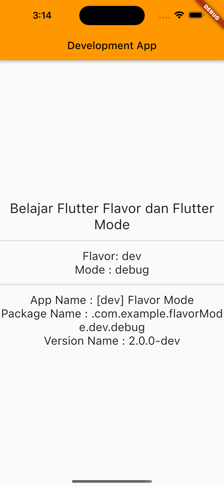
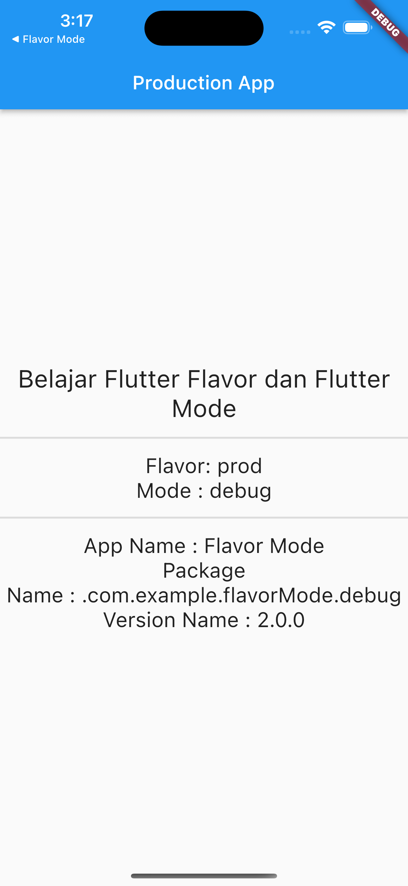

## Description

Projek ini merupakan projek latihan mempelajari bagaimana menerapkan Flavor dan Build Mode dalam satu basis kode aplikasi Flutter. Sebagai gambaran awal, kita akan membuat aplikasi yang digunakan untuk kebutuhan development dan production. Sehingga, kita akan membuat 2 flavor (dev dan prod) dalam 1 basis kode. Setelah kita dapat membagi basis kode menjadi beberapa kombinasi Flavor, pisahkan aplikasi menjadi beberapa build mode (debug, profile, dan release) agar dapat mengetahui performa dan kualitasnya bagi pengguna yang memakainya. 

## Development Setup

Clone the repository and run the following commands:

```
flutter pub get
Klik Tab Run and Debug pada sidebar di bagian kiri.
```

## Source

Dicoding Academy

## Screenshot

 &nbsp; 
